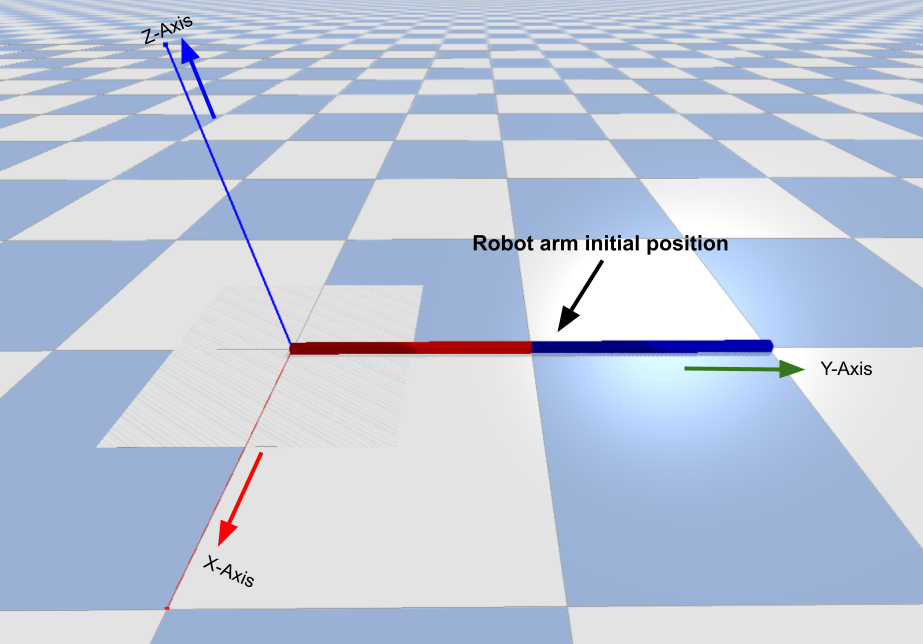
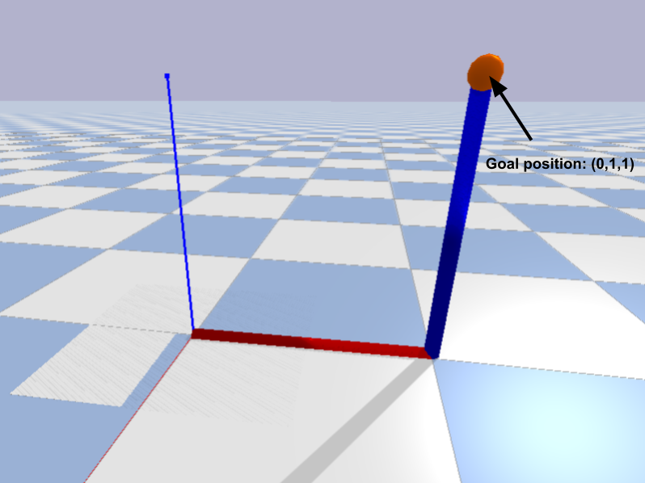
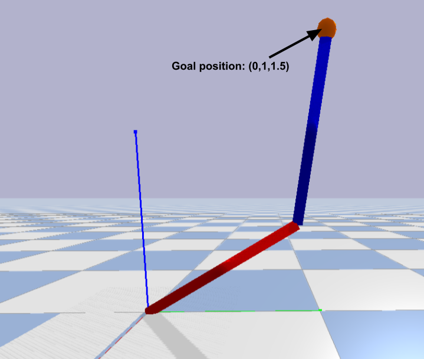
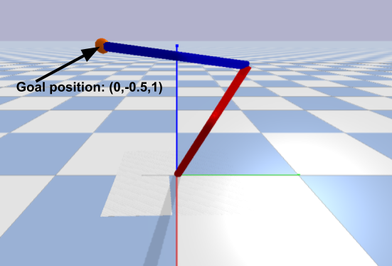

# Inverse Kinematics Numerical Solution
This project involves a solution to the robot arm inverse kinematics using gradient descent optimizaation technique. The algorithm is implemented in python, and the results are simulated using a Pybullet simulation.

# Inverse kinematics overview
Inverse kinematics is a way to transform from the world space system to the robot space system. The input to the inverse kinematics algorithm is the desired end effector cartesian position, and the output is the robot joint variables that make the robot end effector reach that desired position.

# Inverse kinematics as an optimization problem
solving the inverse kinematics problem numerically is done by iteratively guessing the solution until it becomes withiin a certain threshold. This is done by formulating the problem as an optimization one. The optimization method aims at minimizing the difference between the robot end effector current and desired cartesian position. Thus, the cost function will be the euclidean distance between these two position. Gradient descent is used as the optimization algorithm. It iteratively adjusts the joint angles of the robotic arm to minimize the difference between the current end-effector position and the desired end-effector position. In each iteration, the algorithm calculates the gradient of the cost function with respect to the joint angles, and then updates the joint angles by taking a step in the direction of the negative gradient.Once the gradient is calculated, the joint angles can be updated using the following equation:
( θ_i = θ_i - α * ∂C/∂θ_i )
where θ_i is the i-th joint angle, α is the learning rate or step size, and ∂C/∂θ_i is the partial derivative of the cost function with respect to the i-th joint angle.

# Gradient descent algorithm Pseudocode

# Pybullet simulation demos

